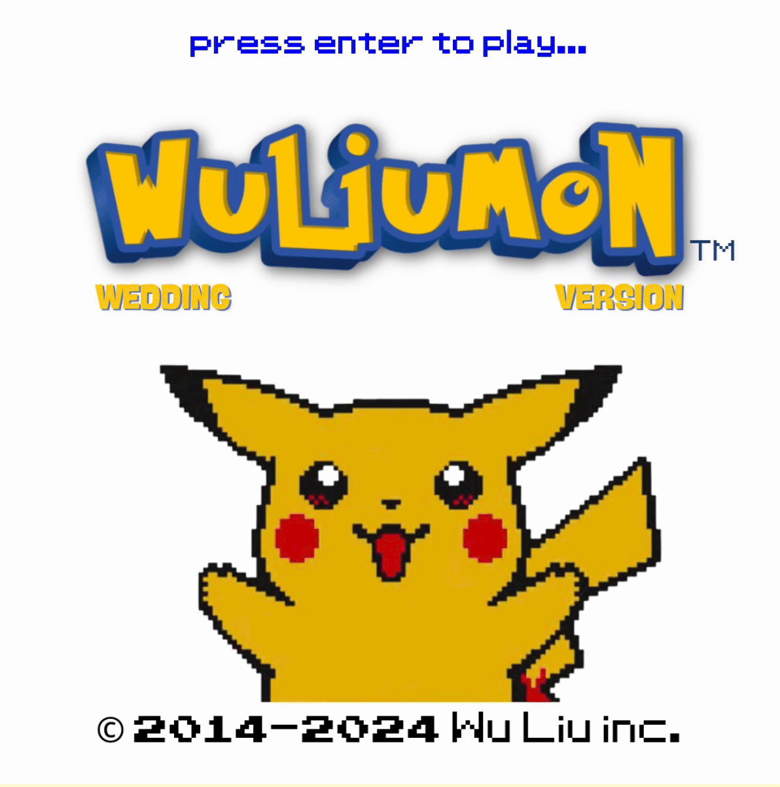
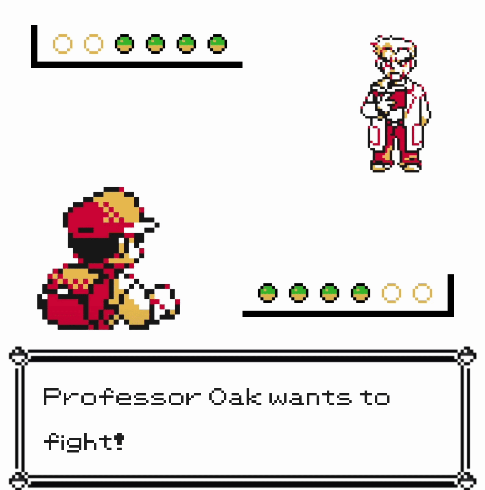
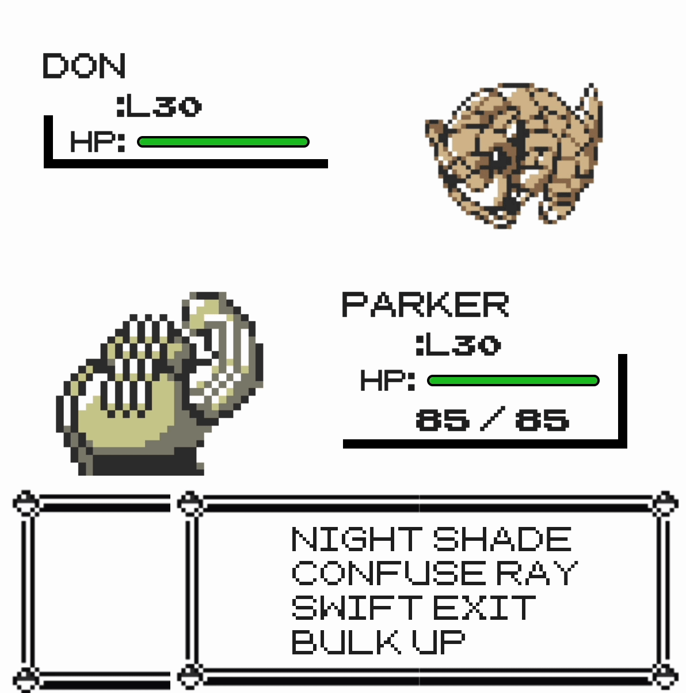

# Pokemon Battle Sim

[demo](https://pokemon-battlesim.vercel.app/)

**🐱 Ever dreamed of making your friends into Pokemon? Now you can. 🐭**

This project is a Pokemon battle simulator that lets you replace the Pokemon with names and moves inspired by your friends. If you've ever told your friends what Pokemon they would be — this is the game for you. Customize the Pokemon, pit friends against friends, and see who would win.

|  |  |  |
|----------------------------------------|----------------------------------------|----------------------------------------|

Now a bit of back story on why it's named WuLiuMon... My fiancé (a Liu) and I (a Wu) are getting married this year and are both big Pokemon fans. As a nod to that, we made a Pokemon battle simulator as our wedding invite... hence the cheeky portmanteau of WuLiuMon. Guests had to blind select one of our Pokemon sets (designed based on our friends), and win the battle in order to score the opportunity to RSVP. We included a good mix of Pokemon types and attack vs. buff moves into each set. However, some guests still reported it was easier to win with one set than the other. We like to think your ability to win is based on how much of a Pokemon master you are, not on how poorly skewed we designed the teams. 😎

We wanted to make it personalized and nostalgic at the same time, so we borrowed the assets from the Pokemon Red/Blue/Yellow Game Boy series. This battle simulator is built in pure React.

You can give our [demo](https://pokemon-battlesim.vercel.app/) version a try, and when you're ready to make your own custom version, follow the instructions below. Gotta catch 'em all! 

## Customization

You can customize Pokemon names and moves by making changes in `app/src/components/Battle.tsx`. Each team has 4 Pokemon, for a total of 8. 
We used the following references for move accuracy, power, and type. 

[**Attacks**](https://bulbapedia.bulbagarden.net/wiki/List_of_moves)
[**Attack Audios**](https://bellblitzking.itch.io/pokemon-sound-collection#download)
[**Pokemon Base Stats**](https://bulbapedia.bulbagarden.net/wiki/List_of_Pok%C3%A9mon_by_base_stats_in_Generation_VII)

We were pretty loosey goosey about move type matching the Pokemon since it mattered to us more to do funny moves. Some of the moves we assigned our friends (like "Read Book" or "Swift Exit" were based on other moves and just renamed to better fit our friends' quirks). 

## Installation

Inside the `app/` folder, run:
```
yarn start
```

## Usage

```
yarn start
```

Have fun! ✨
